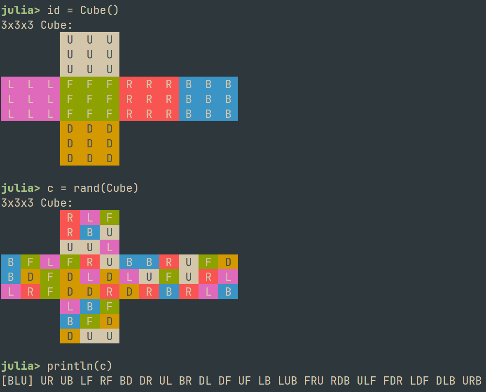
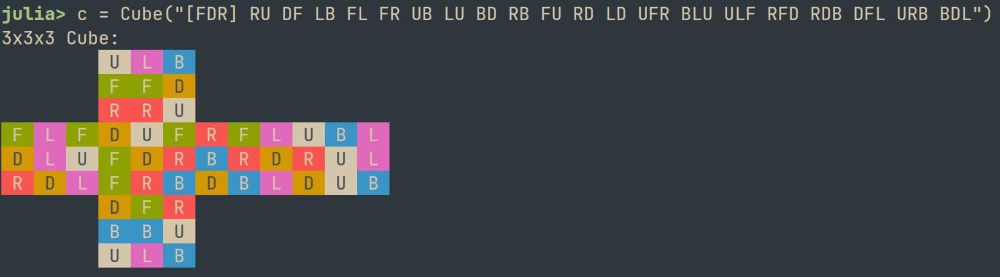

# RubikCore

Representation of a 3x3x3 Rubik's cube in Julia.

[](https://github.com/minhcly95/RubikCore.jl/actions/workflows/CI.yml?query=branch%3Amaster)

## Introduction
This package contains a data structure (`Cube`) that represents the state of a 3x3x3 Rubik's cube.
A `Cube` is an element of the Rubik's cube group, hence we can take its inverse as well as its product with another `Cube`.
Alternatively, one can manipulate a `Cube` using conventional moves such as `U F R D B L` (face turns) and `x y z` (whole cube rotations).
`RubikCore.jl` also provides `Symm` which represents the symmetry of a `Cube` (see [octahedral symmetry](https://en.wikipedia.org/wiki/Octahedral_symmetry)).

> Note: The package does not include an algorithm to solve a `Cube`.
Think of it as a digital version of a Rubik's cube.
However, you can write your own algorithm on top of this package.

This package is optimized for performance and is suitable for enumeration.
In particular, many operations in the package are done without allocating heap-memory, including multiplication and inversion.
The package is heavily inspired by https://www.cube20.org.

## Tutorials

### Construction
```julia
using RubikCore

# Create an identity Cube (solved cube)
id = Cube()

# Create a random Cube
c = rand(Cube)

# Print the cube in text form (using Singmaster's notation)
println(c)
str = RubikCore.singmaster(c)

# Reconstruct the cube from Singmaster's notation
cc = Cube(str)
@assert cc == c
```


### Movement
```julia
# This line will import the move literals such as U, F2, R3, x, M2, b3, etc.
using RubikCore.Literals

# Face turns
c = c * U               # Turn Up face CW
c *= F2                 # Turn Front face 180 deg
c *= B'                 # Turn Back face CCW
c *= L3                 # Turn Left face CCW (same as L')

# Compose new moves by multiplying (left-to-right)
sexy_move = R * U * R' * U'
c *= sexy_move

# Or store the list of moves in a Vector
sledgehammer = [R', F, R, F']
c *= sledgehammer

# Construct a sequence of moves from string
jperm_b = seq"R U R' F' R U R' U' R' F R2 U' R'"
@assert Cube() * jperm_b^3 == Cube()    # Doing J-Perm 3 times reverts back to solved cube

# Whole cube rotations
c *= x
c *= y'
c *= z2

# Slice moves
c *= M
c *= E'
c *= S2

# Wide turns
c *= u * d' * r2 * l3

# Multiply cubes (left-to-right)
a, b = rand(Cube, 2)
c = a * b

# Inverse a cube
@assert inv(c) == c'
@assert c * inv(c) == Cube()
@assert c' * c == Cube()
```

### Symmetry
```julia
# Create an octahedral symmetry
symm = Symm("BLU")

# A Symm is a permutation of faces (U, F, R, D, B, L).
# The 3 letters represent the images of the first 3 faces (U, F, R) by the mapping.
# For example, Symm("BLU") means a mapping from U to B, from F to L, and from R to U.
# As a result, it also maps D to F, B to R, and L to D.
@assert symm(Up) == Back
@assert symm(Front) == Left
@assert symm(Right) == Up
@assert symm(Down) == Front
@assert symm(Back) == Right
@assert symm(Left) == Down
# Note that "Up" refers to the face, while "U" refers to the move.

# Combine symmetries (left-to-right)
symm2 = symm * Symm("DBR")
@assert symm2 == Symm("FLD")

# Inverse
@assert symm * inv(symm) == Symm()  # Symm() is the identity symmetry (i.e. doing nothing)
@assert symm' * symm == Symm()

# Rotate a Cube (by either multiplying or calling Symm as a function)
c = c * symm
@assert c * symm == symm(c)

# Rotate a Move (equivalent to adjoining Cube by Symm)
# Think of Cube as absolute position, while Move as relative position.
m = Move(c)
@assert symm(m) == symm' * c * symm

# For example, if we map U to R, then the action to turn U becomes the action to turn R.
@assert Symm("RFD")(U) == R

# Normalize a cube: realign the center to [UFR]
normalize(c)

# Congruent: 2 cubes are congruent if we can rotate one to the other.
@assert is_congruent(c, normalize(c))
@assert is_congruent(c * rand(Symm), c * rand(Symm))
```

### Canonicalization
We define an equivalence relation of cubes such that `a::Cube` and `b::Cube` are equivalent
iff `a = s' * b * s` for some `s::Symm`. If `a` and `b` are in the same equivalence class (i.e. they are equivalent),
then `a` and `b` can be solved by the same number of moves.
This enables us to reduce the number of positions to enumerate (if we only care about the number of moves),
since all `Cube`s in a class are equivalent to one representative `Cube`.
Such representative is called the *canon* of the class, which is returned by the `canonicalize(::Cube)` function.
```julia
c = rand(Cube)
canon = canonicalize(c)

# The canon is invariant to symmetry
@assert canonicalize(c * rand(Symm)) == canon

# The canon is invariant to adjoint
symm = rand(Symm)
@assert canonicalize(symm' * c * symm) == canon

# The canon is idempotent
@assert canonicalize(canon) == canon
```

### Display
If you want to write a custom display for `Cube`, you can call `RubikCore.net(::Cube)`
to obtain the net representation of a `Cube`.
```julia
c = Cube("[FDR] RU DF LB FL FR UB LU BD RB FU RD LD UFR BLU ULF RFD RDB DFL URB BDL")

RubikCore.net(c)
# Output: (
#     (Up, Left, Back, Front, Front, Down, Right, Right, Up),
#     (Down, Up, Front, Front, Down, Right, Front, Right, Back),
#     (Right, Front, Left, Back, Right, Down, Down, Back, Left),
#     (Down, Front, Right, Back, Back, Up, Up, Left, Back),
#     (Up, Back, Left, Right, Up, Left, Down, Up, Back),
#     (Front, Left, Front, Down, Left, Up, Right, Down, Left)
# )
# Each row contains the colors of a face in the order U F R D B L.
```


